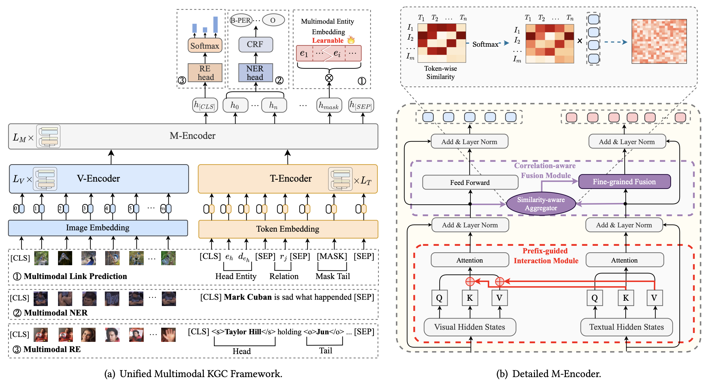

# MKGFormer

Code for the SIGIR 2022 paper "[Hybrid Transformer with Multi-level Fusion for Multimodal Knowledge Graph Completion](https://arxiv.org/pdf/2205.02357.pdf)"

- ❗NOTE: We provide some KGE baselines at [OpenBG-IMG](https://github.com/OpenBGBenchmark/OpenBG-IMG).
- ❗NOTE: We release a new MKG task "[Multimodal Analogical Reasoning over Knowledge Graphs](https://arxiv.org/abs/2210.00312) (ICLR'2023)" at [MKG_Analogy](https://zjunlp.github.io/project/MKG_Analogy/).

# Model Architecture

<div align=center>

</div>
 
 
 Illustration of MKGformer for (a) Unified Multimodal KGC Framework and (b) Detailed M-Encoder.


# Requirements

To run the codes (**Python 3.8**), you need to install the requirements:
```
pip install -r requirements.txt
```

Data Preprocess
==========
To extract visual object images int MNER and MRE tasks, we first use the NLTK parser to extract noun phrases from the text and apply the [visual grouding toolkit](https://github.com/zyang-ur/onestage_grounding) to detect objects. Detailed steps are as follows:

1. Using the NLTK parser (or Spacy, textblob) to extract noun phrases from the text.
2. Applying the [visual grouding toolkit](https://github.com/zyang-ur/onestage_grounding) to detect objects. Taking the twitter2017 dataset as an example, the extracted objects are stored in `twitter2017_aux_images`. The images of the object obey the following naming format: `id_pred_yolo_crop_num.png`, where `id` is the order of the raw image corresponding to the object, `num` is the number of the object predicted by the toolkit. (`id` is doesn't matter.)
3. Establishing the correspondence between the raw images and the objects. We construct a dictionary to record the correspondence between the raw images and the objects. Taking `twitter2017/twitter2017_train_dict.pth` as an example, the format of the dictionary can be seen as follows: `{imgname:['id_pred_yolo_crop_num0.png', 'id_pred_yolo_crop_num1.png', ...] }`, where key is the name of raw images, value is a List of the objects (Note that in `train/val/test.txt`, text and raw image have a one-to-one relationship, so the `imgnae` can be used as a unique identifier for the raw images).

The detected objects and the dictionary of the correspondence between the raw images and the objects are available in our data links.

# Data Download

The datasets that we used in our experiments are as follows:


+ Twitter2017
    
    You can download the twitter2017 dataset from [Google Drive](https://drive.google.com/file/d/1ogfbn-XEYtk9GpUECq1-IwzINnhKGJqy/view?usp=sharing).

    For more information regarding the dataset, please refer to the [UMT](https://github.com/jefferyYu/UMT/) repository.

+ MRE
    
    The MRE dataset comes from [MEGA](https://github.com/thecharm/Mega), many thanks.

    You can download the **MRE dataset with detected visual objects** from [Google Drive](https://drive.google.com/file/d/1q5_5vnHJ8Hik1iLA9f5-6nstcvvntLrS/view?usp=sharing) or using following command:
    
    ```bash
    cd MRE
    wget 120.27.214.45/Data/re/multimodal/data.tar.gz
    tar -xzvf data.tar.gz
    ```

+ MKG

    + FB15K-237-IMG

        You can download the image data of FB15k-237 from [mmkb](https://github.com/mniepert/mmkb) which provides a list of image URLs, and refer to more information of description of entity from [kg-bert](https://github.com/yao8839836/kg-bert) repositories.
        
       - **❗NOTE: we have found a severe bug in the code of data preprocessing for FB15k-237-IMG, which leads to the unfair performance comparison; we have updated the performance in [arxiv](https://arxiv.org/pdf/2205.02357.pdf) and released the [checkpoints](https://drive.google.com/drive/folders/1NsLA7mXaVnhlYNvzRDWIcBxq2CpKF_6m) (The model trained with/without the severe bug).**

    + WN18-IMG

        Entity images in WN18 can be obtained from ImageNet, the specific steps can refer to RSME. the [RSME](https://github.com/wangmengsd/RSME) repository.

We also provide additional network disk links for **multimodal KG data (Images) at [GoogleDrive](https://drive.google.com/file/d/197c4fCLVC6F7sCBqZIDwm5tjWeGJnZ5-/view?usp=share_link) or [Baidu Pan](https://pan.baidu.com/s/1TVArQSLmPjr2FsC8NkSiOA) with extraction (code:ilbd)**.

The expected structure of files is:


```
MKGFormer
 |-- MKG	# Multimodal Knowledge Graph
 |    |-- dataset       # task data
 |    |-- data          # data process file
 |    |-- lit_models    # lightning model
 |    |-- models        # mkg model
 |    |-- scripts       # running script
 |    |-- main.py   
 |-- MNER	# Multimodal Named Entity Recognition
 |    |-- data          # task data
 |    |    |-- twitter2017
 |    |    |    |-- twitter17_detect            # rcnn detected objects
 |    |    |    |-- twitter2017_aux_images      # visual grounding objects
 |    |    |    |-- twitter2017_images          # raw images
 |    |    |    |-- train.txt                   # text data
 |    |    |    |-- ...
 |    |    |    |-- twitter2017_train_dict.pth  # {imgname: [object-image]}
 |    |    |    |-- ...
 |    |-- models        # mner model
 |    |-- modules       # running script
 |    |-- processor     # data process file
 |    |-- utils
 |    |-- run_mner.sh
 |    |-- run.py
 |-- MRE    # Multimodal Relation Extraction
 |    |-- data          # task data
 |    |    |-- img_detect   # rcnn detected objects
 |    |    |-- img_org      # raw images
 |    |    |-- img_vg       # visual grounding objects
 |    |    |-- txt          # text data
 |    |    |    |-- ours_train.txt
 |    |    |    |-- ours_val.txt
 |    |    |    |-- ours_test.txt
 |    |    |    |-- mre_train_dict.pth  # {imgid: [object-image]}
 |    |    |    |-- ...
 |    |    |-- vg_data      # [(id, imgname, noun_phrase)], not useful
 |    |    |-- ours_rel2id.json         # relation data
 |    |-- models        # mre model
 |    |-- modules       # running script
 |    |-- processor     # data process file
 |    |-- run_mre.sh
 |    |-- run.py
```

# How to run


+ ## MKG Task

    - First run Image-text Incorporated Entity Modeling to train entity embedding.

    ```shell
        cd MKG
        bash scripts/pretrain_fb15k-237-image.sh
    ```

    - Then do Missing Entity Prediction.


    ```shell
        bash scripts/fb15k-237-image.sh
    ```

+ ## MNER Task

    To run mner task, run this script.

    ```shell
    cd MNER
    bash run_mner.sh
    ```

+ ## MRE Task

    To run mre task, run this script.

    ```shell
    cd MRE
    bash run_mre.sh
    ```

# Acknowledgement

The acquisition of image data for the multimodal link prediction task refer to the code from [https://github.com/wangmengsd/RSME](https://github.com/wangmengsd/RSME), many thanks.

# Papers for the Project & How to Cite
If you use or extend our work, please cite the paper as follows:

```bibtex
@inproceedings{DBLP:conf/sigir/ChenZLDTXHSC22,
  author    = {Xiang Chen and
               Ningyu Zhang and
               Lei Li and
               Shumin Deng and
               Chuanqi Tan and
               Changliang Xu and
               Fei Huang and
               Luo Si and
               Huajun Chen},
  editor    = {Enrique Amig{\'{o}} and
               Pablo Castells and
               Julio Gonzalo and
               Ben Carterette and
               J. Shane Culpepper and
               Gabriella Kazai},
  title     = {Hybrid Transformer with Multi-level Fusion for Multimodal Knowledge
               Graph Completion},
  booktitle = {{SIGIR} '22: The 45th International {ACM} {SIGIR} Conference on Research
               and Development in Information Retrieval, Madrid, Spain, July 11 -
               15, 2022},
  pages     = {904--915},
  publisher = {{ACM}},
  year      = {2022},
  url       = {https://doi.org/10.1145/3477495.3531992},
  doi       = {10.1145/3477495.3531992},
  timestamp = {Mon, 11 Jul 2022 12:19:20 +0200},
  biburl    = {https://dblp.org/rec/conf/sigir/ChenZLDTXHSC22.bib},
  bibsource = {dblp computer science bibliography, https://dblp.org}
}
```
